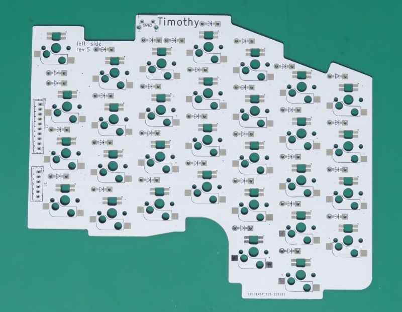
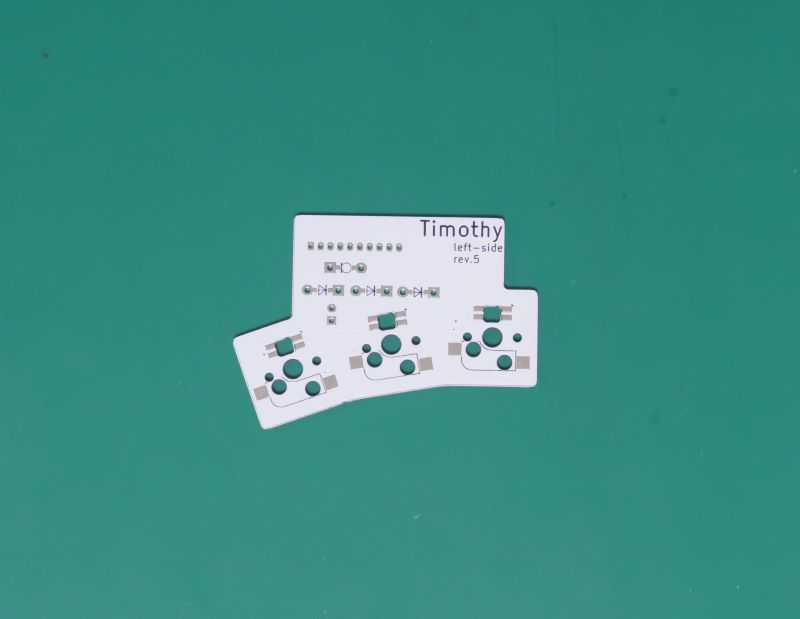
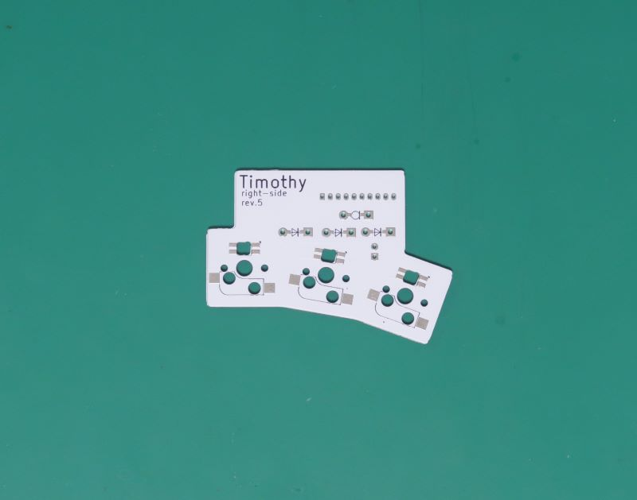

# Timothyのビルドガイド

## 組立の前に

必要なものがすべてそろっていることを確認してください。

### キット内容

- ケース（3Dプリント品-レジン製）
  - 左手用 × 1組
  - 右手用 × 1組
- PCB
  - 左手用 × 1組（メイン・親指・制御用の3枚）
  - 右手用 × 1組（メイン・親指・制御用の3枚）
- プレート × 2組（メイン・親指の2枚）
- ダイオード × 66個
- MX Socket × 66個
- TRRSジャック × 2個
- タクトスイッチ × 2個
- PHコネクタ  6pin × 2個
- PHコネクタ 10pin × 2個
- PHコネクタ(直角)  6pin × 2個
- PHコネクタ(直角) 10pin × 6個
- PHケーブル(10cm)  6pin × 2本
- PHケーブル(10cm) 10pin × 4本
- ピンヘッダ40pin x 2本
- ネオジム磁石 5mmx5mmx2mm × 36個
- クッションスポンジ x 2組（メイン・親指の2枚）
- スポンジテープ 3mmx5mmx1M × 1個
- 透明両面テープ × 6個
- ゴム足 × 8個

#### BLE Micro Pro対応オプションの内容

- コイン電池ホルダ × 4個  
対応するコイン電池は、CR2032
- ショットキーバリアダイオード × 4本
- 100μF キャパシタ × 2本
- 定電流ダイオード(1mA) × 2本
- 低消費3mm LED(緑) × 2本
- 低消費3mm LED(青) × 2本
- スライドスイッチ(ESD175202) × 2本

もし内容物が不足している場合は、[ぎーくらびっと](https://twitter.com/geek_rabb1t) まで問い合わせ願います。

※ 一部、上記キット内容より多めに同梱している部品もあります。

### 別途用意する必要があるもの

- いずれかのマイコンボード × 2枚
  - pro micro(BLE Micro Pro対応オプションを購入していない場合)
  - BLE Micro Pro(BLE Micro Pro対応オプションを購入している場合)
- Cherry MX互換キースイッチ × 66個
- Cherry MX互換キーキャップセット  
1Uサイズが66個必要です。
- マイコンボードに接続するためのUSBケーブル
- TRRSケーブル

#### キーボードを光らせたい場合に追加で用意するもの

- SK6812MINI-E × 66個  
USBケーブルは左手側に接続する必要があります。  
BLE Micro Proを使用する場合は光りません。

必要な部品は、[遊舎工房](https://yushakobo.jp/)さんや、[TALPKEYBOARD](https://talpkeyboard.net/)さんといった、自作キーボードのパーツショップで購入可能です。

### 組み立てに必要な工具類

- 瞬間接着剤
- セロハンテープやビニールテープ
- はんだこて
- はんだ
- ピンセット
- ニッパー
- ハサミ

#### あるといいもの
- 磁石がつく大き目の板（お菓子の缶のフタとか）

## 半完成品を購入されたお客様へ

ほとんど組み立て済みですが、キースイッチの取り付けが必要です。
[ケースへの組み込み](#ケースへの組み込み) 手順を参考に、キースイッチを取り付けてください。

## 白色ケースの注意点

白色のケースの場合、紫外線の影響で徐々に黄ばんで行きます。
UVカットのコーディング材で影響を減らすことができるようです。気になる方は以下のツイートを参考にコーティングすることをおすすめします。

https://twitter.com/tsnd0524/status/1598883986063110146?s=20&t=ZQ7HZPKsKCczbWpmcJGSEw

## ケースの組み立て

マグネットの接着に時間がかかるため、基板の組み立てより先に実施してください。

**※※※※※※※※※※※※※※※※※※※※※※※※※※※※※※※※※**  

**マグネットの向きを間違えると上手くケースを固定できません。  
手順を理解したうえで慎重に作業してください**

**※※※※※※※※※※※※※※※※※※※※※※※※※※※※※※※※※**

### マグネットの準備

マグネット9個をすべて極性がそろうよう、磁石がくっつく場所に一直線に並べます。  
後で、一つ一つ切り離すので、隣の磁石とはある程度（2cm位かな）離して下さい。

この時、磁石がつく大き目の板（お菓子の缶のフタとか）があると便利です。  
もちろん、冷蔵庫の扉などでもOKですし、ピンセットなどで代用しても大丈夫です。  
作業エリアはある程度広いほうがやりやすいです。

極性がそろっている場合、隣通しの磁石が反発しあいます。  
隣の磁石と引き寄せあう場合、極が反転しています。逆向きにして、反発しあうようにして下さい。

磁石を並べ終えたら、磁石の上から、セロハンテープ（ビニールテープでも代用可能）を貼ります。  
これらを **左手のボトムケース用** とします。

先ほど並べた磁石から少し離した場所に同じように9個の磁石を並べます。  
最初の1個目を置く際に、左手用磁石と引き寄せあう状態になっていることを確認してください。

こうすることで、右手用と左手用のキーボードを近づけた時に、磁石で軽くくっつくようになります。

引き寄せあう状態になっていることを確認したら、残りも並べます。  
こちらも隣の磁石とは反発しあう状態になっていることを確認してください。  
確認したら、セロハンテープを貼ります。  
これらを **右手のボトムケース用** とします。

この時点で、以下の状態であることを確認してください。

- 左手のボトムケース用と右手のボトムケース用の磁石同士は引き寄せあう。
- 左手のボトムケース内の磁石同士は反発しあう。
- 右手のボトムケース内の磁石同士も反発しあう。

確認出来たら、左手ボトムケース用の磁石の上に貼ったセロハンテープの上に、
粘着面を上にした、同じ長さのテープを置きます。
テープ越しに磁石がくっつくように、9個の磁石を並べます。
この9個の磁石は **左手トップケース用** の磁石となります。

同じように、右手ボトムケース用の磁石の上にも、セロハンテープを置き、磁石を並べます。
こちらの9個は **右手トップケース用** の磁石となります。

並べきったら、磁石の間のテープをカットしていきます。  
これで、磁石の準備が整いました。余った磁石は予備および、極性の確認用です。

### マグネットをケースへ貼り付け

まずは左手トップケースにマグネットを接着していきます。

トップケースでは、 **粘着面が上を向いている** マグネットのみを使用します。  
右手用、左手用を間違えないように注意してください。

マグネットの貼り付けは以下のように行ってください。

1. ケースのマグネット貼り付け用のエリアに、ゴマ粒程度の大きさの瞬間接着材を垂らします。  
接着剤の量が多いと、接着剤がはみ出してきたなくなってしまいます。  
接着剤はなるべく少量にすることがポイントです。  

2. 先ほど準備したテープ付きのマグネットを貼り付けます。
3. マグネットについているテープで仮止めします。  
完全に接着するまでは、テープをはがさないでください。  

4. 完全に固定出来たら、仮止めのテープをはがしてください。  
接着材にもよりますが、最低2時間程度。  
出来れば一晩から丸一日程度待ってからテープをはがしてください。  

左手トップケースへのマグネット固定が終わったら、すべてのマグネットが同じ極性になっていることを、再度確認します。  
予備のマグネットをケースの内側から当てて、磁極が同じことを確認してください。

問題なければ、同様の手順で、左手、ボトムケースにマグネットを固定します。  
ボトムケースでは、 **粘着面が下を向いている** マグネットを使用します。

もし、極性が異なる場所がある場合、トップケースのマグネット固定時にその部分だけ極性を反転させます。

ボトムケースもマグネット固定が終わったら、予備のマグネットで極性がそろっていることを確認してください。

左手ケースのマグネット接着が終わったら、同じように右手ケースもマグネットを接着します。

## 基板の組み立て

基板は左手用と、右手用とそれぞれ区別があります。  
各基板に、それぞれ、left-side、right-sideと記載がありますので間違えないようにして下さい。

### メイン基板

#### 左手用

以下の順番に部品をはんだ付けします。

##### SK6812MINI-Eの取り付け（各キーを光らせたい場合）

SK6812MINI-E は熱に弱いので注意してはんだ付けを行ってください。  
SK6812MINI-E の端子が斜めになっている部分を基板の三角マークに合わせて配置します。

パッド部分を広めに設計しているため、予備ハンダ無しでもハンダ付けすることができます。  
もちろん、予備ハンダをしてから取り付けても構いません。  

先に片側のパッドをハンダ付けします。

そのあと、残りのパッドをはんだ付けします。

一通りはんだ付けが終わったら、部品が浮いていないか確認してください。
特に、PHコネクタ周りは、後で修正が大変なので注意してください。

##### ダイオードの取り付け

ダイオードの脚を折り曲げます。
スイッチプレートや、基板4枚の厚みで折り曲げるとちょうどいい幅になります。

足を折り曲げたら、基板のランドに差し込みます。ダイオードの向きに注意して取り付けてください。  
ダイオードの黒い側と基板の縦線のマークが同じ向きになるようにします。  
部品を取り付けたら、基板の反対側に出ている脚を少し広げて、部品が落ちないようにします。

取り付けが終わったら、方向が間違っている部品がないか確認してください。  
すべてのダイオードが同じ向きを向くよう設計していますので、全部同じ向きになっていれば大丈夫です。

すべての向きが正しければ、基板の裏側からひとつづはんだ付けをします。  
はんだ付け出来たら、ダイオードの脚をニッパーでカットします。  
このとき、できるだけ基板ギリギリで脚を切り取るようにして下さい。

##### MX ソケットの取り付け

MX ソケットを基板に置き、片側ずつ、順にはんだ付けします。
シルクの通りに部品を配置します。数が多いので、向きを間違えないように注意してください。

一通りはんだ付けが終わったら、部品が浮いている場所がないか確認します。

問題無いようであれば、一度、ソケットにスイッチを取り付けます。  
上手くはんだ付けできていない箇所がある場合、スイッチ取り付け時にソケットが浮いてきます。  
浮いてくるソケットがあれば、この時点で修正します。

問題がなければ、スイッチを外して、次の手順に進みます。

##### タクトスイッチの取り付け

タクトスイッチを基板に取り付け、基板の裏側からはんだ付けします。
ダイオードと同じように、飛び出した脚をカットしてください。

##### PHコネクタの取り付け

PHコネクタ取り付け後にミスが発覚すると修正難易度がとても高くなります。
取り付け前に表面実装部品にが正しくはんだ付けできているか確認してください。

メイン基板では、PHコネクタ 10pin と PHコネクタ 6pin を使います。
どちらも、垂直に刺さるケーブルコネクタです。
ここでは、直角方向に刺さるコネクタは使用しません。

コネクタの向きを間違えないように注意してください。
コネクタの壁が高いほうが基板の外側を向くように取り付けます。

コネクタを基板に取り付けたら、基板の裏側からはんだ付けします。
こちらも飛び出した脚をカットしてください。

#### 右手用

左手側と同じように組み立てます。

### サム基板

#### 左手用

順番に部品をはんだ付けします。

以下の部品の取り付け手順はメイン基板と同様です。
詳細は、メイン基板の手順をご覧ください。

1. SK6812MINI-Eの取り付け（各キーを光らせたい場合）  
2. ダイオードの取り付け  
3. MX ソケットの取り付け  

##### サム基板独自の手順

##### 定電流ダイオードの取り付け手順 (BLE Micro Pro対応オプションのみ)

BLE Micro Proオプションに含まれる定電流ダイオードを取り付けます。  
通常のダイオードとほとんど同じ形なので間違えないように注意してください。

どれが定電流ダイオードかわからなくなった場合、黒いラインを下にしたときに `10XX`(XXは2桁のロットNo.) と読めるほうが定電流ダイオードです。  
正確な見分け方ではありませんが、若干直径が大きいものが定電流ダイオードです。

定電流ダイオードも向きがあります。  
向きを間違えないよう、取り付けてください。  
また、右手用と左手用とで取り付け方向が逆になっているので注意してください。

##### ケーブルコネクタの取り付け手順

PHコネクタ(直角) 10pin を基板の裏側に取り付けます。  
はんだ付けしたら、飛び出した脚をカットしてください。

##### インジケータLEDの取り付け手順 (BLE Micro Pro対応オプションのみ)

青色LEDもしくは緑色LEDのうち、好きなほうを選んで取り付けます。  
LEDも向きがあるので取り付け方向を間違えないよう注意してください。

また、極力部品が浮かないよう、注意して取り付けてください。

#### 右手用

左手側と同じように組み立てます。

### コントロール基板

Pro microや、BLE Micro Proの固定にはコンスルーを使うことも可能です。
コンスルーを使う場合は、ご自身で調達してください。

#### 左手用

以下の順番に部品をはんだ付けします。

##### マイコンボードへピンヘッダを取り付ける

コンスルーを使って、BLE Micro Proを接続する場合は不要です。  

付属のピンヘッダを12ピン（BLE Micro Proの場合は13ピン）分でカットします。  
マイコンボード付属のピンヘッダを使っても構いません。

以下の手順で、マイコンボードにピンヘッダをはんだ付けします。  
ピンヘッダが飛び出ていると、他の部品とショートする可能性があるため、極力ピンヘッダがはみ出ないようにします。

1. ピンヘッダの脚が短い方をコントロール基板に差し込みます。  

2. ピンヘッダの脚が長い方にマイコンボードを差し込みます。  

3. ピンヘッダの両端だけ、マイコンボードから飛び出した脚をピンをニッパーで切り取ります。  

4. ニッパーで切り落とした両端のみはんだ付けして、ピンヘッダを固定します。  

5. 残りの脚もピンヘッダを切り取り、はんだ付けします。  

##### 各種部品の取り付け

以下の順に部品を取り付けます。

1. コイン電池ホルダの取り付け(BLE Micro Pro対応オプションのみ)  
+-を間違えないように注意して取り付けてください。  

2. PHコネクタの取り付け
3. スライドスイッチの取り付け(BLE Micro Pro対応オプションのみ)
4. TRRSコネクタの取り付け
5. マイコンボードの取り付け  
Pro Microの場合、一番上のランドは使用しません。
下側がそろうよう、はんだ付けしてください。
  
6. ショットキーバリアダイオードの取り付け(BLE Micro Pro対応オプションのみ)  
向きがあります。青緑の線が引いてある方が上向きになるよう、取り付けてください。
  
7. キャパシタの取り付け(BLE Micro Pro対応オプションのみ)  
向きはないので極性を気にせずに取り付けられます。

#### 右手用

左手側と同じように組み立てます。

## ケースへの組み込み

### スイッチの取り付け

スイッチプレートは左右の区別はありません。左手と右手でそれぞれ表裏を入れ替えて使用します。

スイッチプレートにキースイッチを取り付けます。  
スイッチの端子がキーボードの下側にそろうよう、取り付けます。

取り付けが終わったら、クッションスポンジを間に挟み、基板に差し込みます。
無理に差し込むと、脚が曲がる場合があるので注意してください。

BLE Micro Pro対応オプションを購入している場合、スイッチプレートの丸い穴にLEDが収まっていることを確認してください。

### ケーブルの取り付け

メイン基板、サム基板、コントロール基板をケーブルで接続します。
写真のような位置関係になるよう、接続してください。

発送前に確認していますが、ケーブルの結線がクロスしているものが紛れ込んでいるかもしれません。  
その場合、以下のサイトを参考に、ケーブルを修正してください。  
https://xn--p8jqu4215bemxd.com/archives/397#i-6

### ファームウェアの書き込み&動作確認

組み立てにミスがあった場合、ケースへの組み込み後に修正するのは大変です。
ケースへの組み込み前に動作確認をしてください。

### Pro Micro（通常の手順）の場合

左右のキーボードに同じファームウェアを書き込みます。
ファームウェアの書き込みが終わったら、左右のキーボードをtrrsケーブルで接続します。
接続後、左手側のキーボードだけをPCに接続します。

各キーが入力できることを確認してください。
デフォルトのキーマップは以下のpdfを確認してください。

https://github.com/geek-rabb1t/timothy/blob/master/firmware/pro_micro/keymap_cheatsheet_timothy.pdf

#### QMK Toolbox を使ったファームウェアの書き込み手順

以下のサイトからQMK Toolbox をダウンロードし、インストールします。

https://github.com/qmk/qmk_toolbox/releases

インストールしたら、以下のURLからファームウェアをダウンロードします。

https://github.com/geek-rabb1t/timothy/blob/master/firmware/pro_micro/timothy_via.zip

QMK Toolboxを以下のように設定したら、片手分のキーボードをPCに接続します。
コントロール基板のリセットをピンセットでショートし、書き込みを行います。

#### キーマップの変更方法

Remapを使うことで、自由にキーマップを変更することができます。
Chromeでサイトにアクセスして変更してください。

まだ、Remapへの登録申請が済んでいないので、キーマップ書き換えJSONファイルが必要となります。
以下のURLからダウンロードしてください。

https://github.com/geek-rabb1t/timothy/blob/master/firmware/pro_micro/Timothy-via.json

### BLE Micro Proの場合

以下のzipファイルをダウンロードします。

https://github.com/geek-rabb1t/timothy/blob/master/firmware/ble_micro_pro/setting.zip

マイコンをPCに接続し、zipファイル内のJSNファイルをマイコンに書き込みます。

左手側に書き込むファイル：

- left_hand/CONFIG.JSN
- keymap.jsn
- TAPTERM.JSN

左手側に書き込むファイル：

- right_hand/CONFIG.JSN
- keymap.jsn
- TAPTERM.JSN

keymapを変更したい場合は、keymap.jsnファイルを変更します。
詳しい手順は、以下のドキュメントを参考にしてください。

https://sekigon-gonnoc.github.io/BLE-Micro-Pro/#/

### コントロール基板の固定

コントロール基板を付属の両面テープでケースに固定します。
Pro microの長さが異なる場合があるので、コンスルーを使う場合でも、必ず、 Pro microを取り付けた状態で行ってください。

写真の位置に当たりに付属の両面テープを貼り付けます。

Pro microもしくは、BLE Micro Proを取り付けた状態で、USBコネクタ側の基板がケース上端にあたるような位置にで貼り付けます。

### メイン基板・サム基板の固定

メイン基板・サム基板はスポンジで押さえつけているだけです。
トップケースへの固定はスポンジテープで、
ボトムケースへの固定はスイッチプレートと基板の間に挟んだクッションスポンジで行います。

#### スポンジテープの貼り付け

スポンジテープ1本(約1メートル)で両手分です。
スポンジテープをハサミでカットし、トップケース裏側のへ貼り付けます。
貼り付ける位置は、以下の写真を参考にしてください。

#### ケースを閉める

1. 基板間の配線が固く、基板が浮いてしまうので、配線を折り曲げて、基板が浮かないよう癖をつけます。
2. スイッチプレートをボトムケースに載せます。

3. トップケースを真上から、そっと下におろすと、磁力で固定されます。  
斜めに取り付けようとすると、ケースが壊れる場合があります。  
上手く取り付けられない場合、人差し指側から先に固定されるようなイメージで下におろしてください。

組み立て手順は、これで終わりです！
最後まで組み立ててくれてありがとうございます。

引き続き、自作キーボードを楽しんでくださいね～

## ケースの開け方

机の上など、安定した場所で作業してください。

1. ケース全体を少し持ち上げます。
2. 両手で、トップケースの縁に指をかけます。
3. キースイッチ毎、ボトムケースを親指で押します。

